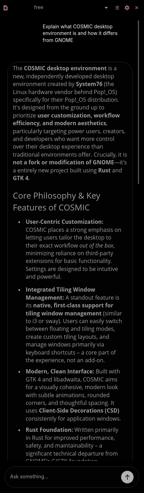
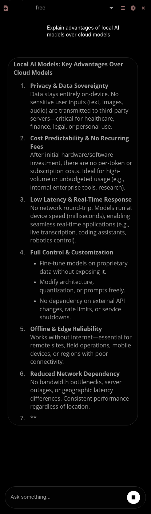
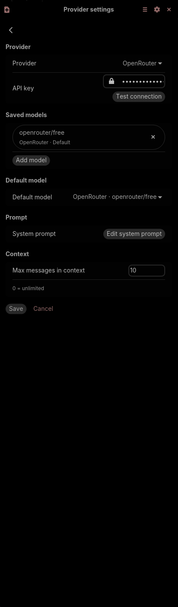
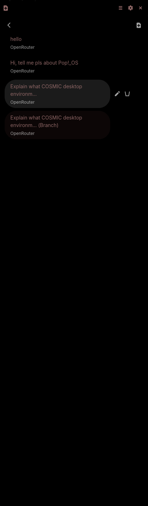

Cosmic AI Panel

Minimal AI assistant panel for the **COSMIC desktop environment**.

Cosmic AI Panel adds a lightweight assistant directly into the system panel and provides fast access to local or remote AI models without leaving your workflow.

Supports both cloud and local providers with streaming responses and persistent chat sessions.

---

## Installation

Download latest release:
https://github.com/levlandon/cosmic-ai-panel/releases/latest

---

## Features

* panel-integrated assistant UI
* streaming responses
* editable user messages
* regenerate responses
* branch conversations
* configurable context limit
* system prompt editor
* local-first chat storage
* safe persistence with backup fallback
* onboarding placeholder UI for empty chats
* OpenRouter support
* LM Studio local model support

## Screenshots

### Chat interface




### Settings



### Conversation branching


---

## Installation

### From release archive

Download latest release:
https://github.com/levlandon/cosmic-ai-panel/releases/latest

Then install:

```
tar -xzf cosmic-ai-panel-linux-x86_64.tar.gz
cd cosmic-ai-panel
./install.sh
```

Restart panel if needed

Add **Cosmic AI Panel** via:

Panel → Add Applet

---

### Build from source

Requires Rust toolchain.

```
cargo build --release
```

Binary will be available at:

```
target/release/cosmic-ai-panel
```

---

## Configuration

Open Settings inside the panel UI and configure:

* provider (OpenRouter or LM Studio)
* model name
* system prompt
* context limit

Example OpenRouter model:

```
openrouter/free
```

---

## Supported providers

### OpenRouter

Cloud-based model access via API key.

https://openrouter.ai

---

### LM Studio

Local inference support via HTTP endpoint.

https://lmstudio.ai

---

## Storage model

Cosmic AI Panel uses local-first persistence:

* chats stored locally
* safe atomic saves
* backup fallback support
* no background telemetry

API keys are stored locally and never transmitted outside configured providers.

---

## Status

Current version: **alpha**

Core functionality is stable and usable.
UI polish and ecosystem integrations are still evolving.

Feedback and testing are welcome.

---

## Releases

Latest release:

https://github.com/levlandon/cosmic-ai-panel/releases/latest

All versions:

https://github.com/levlandon/cosmic-ai-panel/tags

---

## License

MIT
